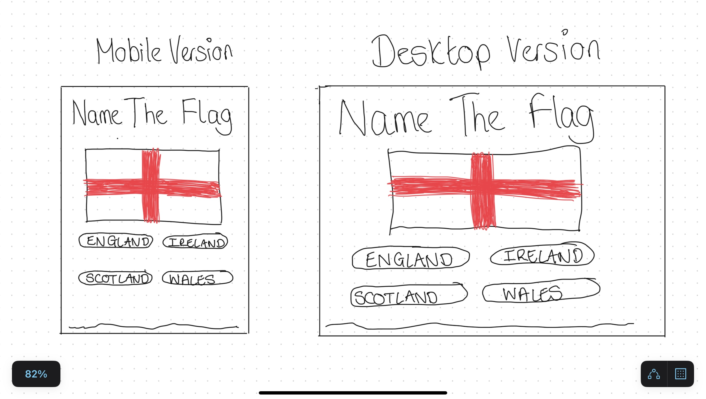
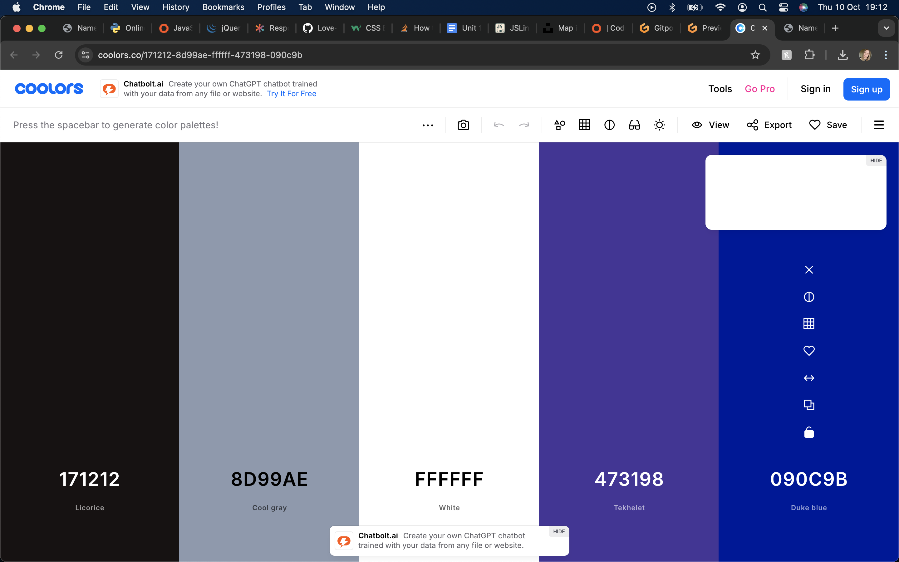

# [NAME THAT FLAG](https://github.com/Georgina90-x/Project-2 "Click to view the deployed site")

- Name That Flag is a simple website that has a game for users to test their knowledge of world flags.
- Name That Flag has been designed for all users to be able to play the game with ease by implementing standardised structure.
- Name That Flag is a fun game suitable for all ages of users.
- Name That Flag shows a large flag and gives 3 options for the user to select their answer.
- Name That Flag has a total of 10 questions to answer, each time randomised.

## Table of Contents

Click here for Table of Contents

[Mockup Screenshots](#mockup-screenshots)

[UX](#ux)

- [Colour Scheme](#colour-scheme)
- [Typography](#typography)

[User Stories](#user-stories)

- [New site Users](#new-site-users)
- [Returning Site Users](#returning-site-users)

[Wireframes](#wireframes)

- [Mobile Wireframes](#mobile-wireframes)
- [Tablet Wireframes](#tablet-wireframes)
- [Desktop Wireframes](#desktop-wireframes)

[Features](#features)

- [Existing Features](#existing-features)
- [Future Features](#future-features)

[Testing](#testing)

[Deployment](#deployment)

- [Local Deployment](#local-deployment)

  - [Cloning](#cloning)
  - [Forking](#forking)

- [Local vs Deployment](#local-vs-deployment)

[Credits](#credits)

- [Content and Code](#content-and-code)

- [Media](#media)

- [Acknowledgments](#acknowledgements)

##  Wireframes

I have provided a screenshot of an initial design idea for the layout of Name That Flag.

| Screenshot |
| :---: |
|  |

## UX

- The wireframe design of Name That Flag demonstrates its suitability for both mobile and desktop design.
- Name That Flag has a block colour background that does not distract or visually impair users from being able to see the flags as they are intended.
- It is clear to the user that Name That Flag is a game and that they are given options to select the answer that identifies the flag.

### Colour Scheme

- As Name That Flag is a game that involves flags with a number of colours, it was important for the background to be unobtrusive and allowed to show the flags correctly to avoid any doubt or confusion for the user.
- The colours used are as follows:-

- `#171212` licorice used for primary text.
- `rgba(210, 204, 189, 0.736)` was used for the background overlay.
- `#FFFFFF` white was used for the answer buttons so the writing was clearly legible with no problems for those with colour blindness or difficulty reading.
- `#4cbb17` kelly green was used as the 'correct' colour indicator.
- `#b22222` crimson was used as the 'incorrect' colour indicator.

I used [coolors.co](https://coolors.co/171212-8d99ae-ffffff-473198-090c9b) to generate my colour palette, I locked in licorice and white as I knew I wanted these as the main colours to the site and then ran through the simulations to generate alternative colours that may complement as contrast but I knew that a majority of the site would be white with black text.

Click for Coolors screenshot

 

### Typography

- I used the Google Font called 'Nunito' for the Name That Flag site.
- As a key part of the game was for users to read the options available to them, it was imperitive that a clean legible font was used suitable for all users to clearly read the text on the website especially when using a mobile device.

- [Nunito](https://fonts.google.com/specimen/Nunito) was used for all text within the site.

## User Stories

### New Site Users

- As a new site user, I would like to know the purpose of the site, so I understand why I might use it.
- As a new site user, I would like to be able to clearly see the flag and it's answers so I can make an informed choice.
- As a new site user, I would like to be able to select my answer with ease and be told if I am correct or not.
- As a new site user, I would like to be able to keep a track of my score as a way as determining my success.
- As a new site user, I would like to be able to restart the game again in order to improve my score.

### Returning Site Users

- As a returning site user, I would like to be met with the game in the format I am accustommed to.
- As a returning site user, I would like to be challenged to questions I have not seen before.

## Features

### Existing Features

| Feature | Description | Screenshot |
| :---: | :---: | :---: |
| **About Name That Flag** | Although 'Name That Flag' should be obvious upon accessing the site, I wanted to create a page that clearly met the standardised and accepted format of a multiple choice quiz. |  |
| **Name That Flag Game Area** | The game is designed to be viewed in one screen. For example, on a mobile sized screen you can see the flag, the answer options and the score without having to scroll. |  |
| **Answer Buttons** | The buttons are designed in a way that the user knows they are to click on them to select their answer by a pointer appearing when the cursor is over the answers. |  |

### Future Features

- A high score table
  - A feature that will keep a record of the users previous scores in a top 10 format.
- More flag questions 
  - An update that can further challenge users. their knowledge of flags.
- Multiplayer mode
  - A feature that will allow users to play against eachother to see who knows their flags more.

## Tools & Technologies Used

- [HTML](https://en.wikipedia.org/wiki/HTML) used for the main site content.
- [CSS](https://en.wikipedia.org/wiki/CSS) used for the main site design and layout.
- [CSS :root variables](https://www.w3schools.com/css/css3_variables.asp) used for reusable colours throughout the site.
- [JavaScript](https://www.javascript.com) used for user interaction on the site.
- [GitHub](https://github.com) used for secure online code storage.
- [GitHub Pages](https://pages.github.com) used for hosting the deployed front-end site.
- [VSCode](https://code.visualstudio.com/) used for local IDE for development.
- [Google Fonts](https://fonts.google.com/) used to search a suitable font and obtain a download link for that font.

## Testing

For all testing, please refer to the [TESTING.md](TESTING.md) file.

## Deployment

The site was deployed to GitHub Pages. The steps to deploy are as follows:

- In the [GitHub repository](https://github.com/Georgina90-x/Name-That-Flag), navigate to the Settings tab.
- From the source section drop-down menu, select the **Main** Branch, then click "Save".
- The page will be automatically refreshed with a detailed ribbon display to indicate the successful deployment.

The live link can be found [here](https://georgina90-x.github.io/Name-That-Flag/).

### Local Deployment

This project can be cloned or forked in order to make a local copy on your own system.

#### Cloning

You can clone the repository by following these steps:

1. Go to the [GitHub repository](https://github.com/Georgina90-x/Name-That-Flag).
2. Locate the Code button above the list of files and click it.
3. Select if you prefer to clone using HTTPS, SSH, or GitHub CLI and click the copy button to copy the URL to your clipboard.
4. Open Git Bash or Terminal.
5. Change the current working directory to the one where you want the cloned directory.
6. In your IDE Terminal, type the following command to clone my repository:
    - `git clone https://github.com/Georgina90-x/Name-That-Flag`
7. Press Enter to create your local clone.

## Credits

The following are credits to various people and technologies that have directly or otherwise assisted in the creation of the Name That Flag site.

### Content and Code

| Source | Location | Notes |
| --- | --- | --- |
| [W3Schools](https://www.w3schools.com/howto/howto_css_modals.asp) | Main page | interactive pop-up (modal) for the about section |
| [W3Schools](https://www.w3schools.com/howto/howto_css_switch.asp) | Main page | interactive toggle switch |
| [YouTube](https://www.youtube.com/watch?v=WZNG8UomjSI&t=1783s) | Main page | a source to get an idea of how to lay out the page |
| [Wikipedia](https://en.wikipedia.org/wiki/List_of_short_place_names) | Javascript | helped in determining whether name validation is needed or not |
| [United Kingdom Flag](https://es.wikipedia.org/wiki/Reino_Unido#/media/Archivo:Flag_of_the_United_Kingdom_(1-2).svg) | Flag
| [France Flag](https://es.wikipedia.org/wiki/Francia#/media/Archivo:Flag_of_France_(1794%E2%80%931815,_1830%E2%80%931974,_2020%E2%80%93present).svg) | Flag
| [Germany Flag](https://upload.wikimedia.org/wikipedia/en/b/ba/Flag_of_Germany.svg) | Flag
| [Netherlands Flag](https://upload.wikimedia.org/wikipedia/commons/2/20/Flag_of_the_Netherlands.svg) | Flag
| [Sweden Flag](https://en.wikipedia.org/wiki/Sweden#/media/File:Flag_of_Sweden.svg) | Flag
| [Denmark Flag](https://en.wikipedia.org/wiki/Denmark#/media/File:Flag_of_Denmark.svg) | Flag
| [Italy Flag](https://en.wikipedia.org/wiki/Italy#/media/File:Flag_of_Italy.svg) | Flag
| [Spain Flag](https://en.wikipedia.org/wiki/Spain#/media/File:Bandera_de_Espa%C3%B1a.svg) | Flag
| [Portugal Flag](https://en.wikipedia.org/wiki/Portugal#/media/File:Flag_of_Portugal.svg) | Flag
| [Belgium Flag](https://en.wikipedia.org/wiki/Belgium#/media/File:Flag_of_Belgium.svg) | Flag
| [United States Flag](https://upload.wikimedia.org/wikipedia/commons/a/a9/Flag_of_the_United_States_%28DoS_ECA_Color_Standard%29.svg) | Flag
| [China Flag](https://upload.wikimedia.org/wikipedia/commons/f/fa/Flag_of_the_People%27s_Republic_of_China.svg) | Flag
| [South Africa Flag](https://en.wikipedia.org/wiki/South_Africa#/media/File:Flag_of_South_Africa.svg) | Flag
| [India Flag](https://en.wikipedia.org/wiki/India#/media/File:Flag_of_India.svg) | Flag
| [Russia Flag](https://en.wikipedia.org/wiki/Russia#/media/File:Flag_of_Russia.svg) | Flag
| [Republic of Ireland Flag](https://en.wikipedia.org/wiki/Republic_of_Ireland#/media/File:Flag_of_Ireland.svg) | Flag
| [Brazil Flag](https://en.wikipedia.org/wiki/Brazil#/media/File:Flag_of_Brazil.svg) | Flag
| [Canada Flag](https://en.wikipedia.org/wiki/Canada#/media/File:Flag_of_Canada_(Pantone).svg) | Flag
| [Japan Flag](https://en.wikipedia.org/wiki/Japan#/media/File:Flag_of_Japan.svg) | Flag
| [Mexico Flag](https://en.wikipedia.org/wiki/Mexico#/media/File:Flag_of_Mexico.svg) | Flag
| [Australia Flag](https://en.wikipedia.org/wiki/Australia#/media/File:Flag_of_Australia_(converted).svg) | Flag

### Acknowledgements

- I would like to thank my tutor Jonathan Jacobson and my classmates Ethan Peters and Tyrone Tuazon for their assistance and support during this project.
- I would like to thank the [Code Institute Slack community](https://code-institute-room.slack.com) for being an awesome and responsive support system during a unit I found incredibly challenging.