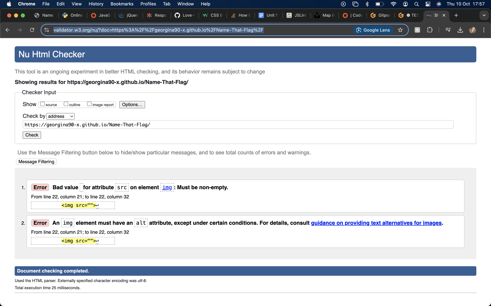

# Testing

Return back to the [README.md](README.md) file.

## Table of Contents

Click here for Table of Contents

- [Code Validation](#code-validation)
  - [HTML](#html)
  - [CSS](#css)
  - [JavaScript](#javascript)

- [Browser Compatibility](#browser-compatibility)

- [Responsiveness](#responsiveness)

- [Accessibility](#accessibility)

- [User Story Testing](#user-story-testing)

## Code Validation

### HTML

I have used the recommended [HTML W3C Validator](https://validator.w3.org) to validate all of my HTML files.

| Page | W3C URL | Screenshot | Notes |
| :---: | :---: | :---: | :---: |
| Main Page | [W3C](https://validator.w3.org/nu/?doc=https%3A%2F%2Fgeorgina90-x.github.io%2FName-That-Flag%2F) |  | IMG is empty due to it being filled with images via JS |

### CSS

I have used the recommended [CSS Jigsaw Validator](https://jigsaw.w3.org/css-validator) to validate all of my CSS files.

| File | Jigsaw URL | Screenshot | Notes |
| :---: | :---: | :---: | :---: |
| style.css | [Jigsaw](https://jigsaw.w3.org/css-validator/validator?uri=https%3A%2F%2Fgeorgina90-x.github.io%2FName-That-Flag%2F&profile=css3svg&usermedium=all&warning=1&vextwarning=&lang=en) |  | Pass: No Errors |

### JavaScript

I have used the recommended [Code Beautify](https://codebeautify.org/jsvalidate) to validate all of my JS files.

| File | Screenshot | Notes |
| :---: | :---: | :---: |
| main.js |  | Unexpected let, needed for count function |

## Browser Compatibility

I have tested Your Weather on the following browsers to check for compatibility issues.

| Browser | Main | Score |
| :---: | :---: | :---: |
| [Chrome](https://www.google.com/chrome) |  |  |  |  | Works as expected |
| [Firefox (Developer Edition)](https://www.mozilla.org/firefox/developer) |  |  |  |  | Works as expected |
| [Edge](https://www.microsoft.com/edge)|  |  |  |  | Works as expected |
| [Safari](https://support.apple.com/downloads/safari) |  |  |  |  | Works as expected |
| [Brave](https://brave.com/download) |  |  |  |  | Works as expected |

## Responsiveness

I have tested my deployed project on multiple devices to check for responsiveness issues.

Click for report

| Device | Main | Score |
| :---: | :---: | :---: | :---: |
| Mobile (iPhone 15 Pro) |  |  | Appeared as expected |
| Tablet (DevTools - iPad Air) |  |  | Appeared as expected |
| 15" Laptop |  |  |

## Accessibility

I have tested my deployed project using the [WAVE](https://wave.webaim.org/) web accessibility evaluation tool to check for any accessibility issues.

| Page | Summary | Details | Contrast | Notes |
| :---: | :---: | :---: | :---: | :---: |
| Main |  |  |  | The error is due to there being no alt information for the image, due to the nature of the quiz a user with limited to no eyesight would find this game difficult to play. There is also a missing H2 as I wanted a smaller sized heading. |

## User Story Testing

| User Story | Screenshot |
| :---: | :---: |
| As a new site user, I would like to know the purpose of the site, so I understand why I might use it. |  |
| As a new site user, I would like to be able to clearly see the flag and it's answers so I can make an informed choice. |  |
| As a new site user, I would like to be able to select my answer with ease and be told if I am correct or not. |  |
| As a new site user, I would like to be able to keep a track of my score as a way as determining my success. |  |
| As a new site user, I would like to be able to restart the game again in order to improve my score. |  |

| As a returning site user, I would like to be met with the game in the format I am accustommed to. | |
| As a returning site user, I would like to be challenged to questions I have not seen before.|  |  |
